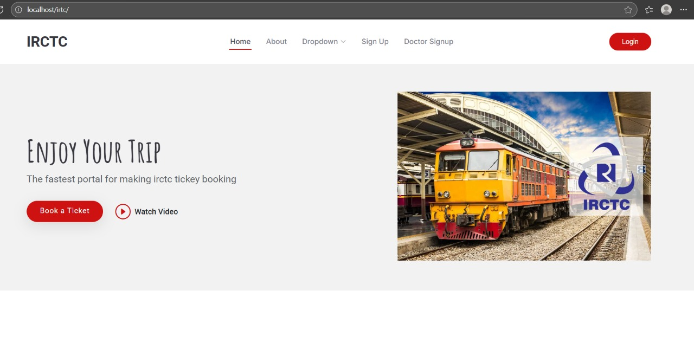
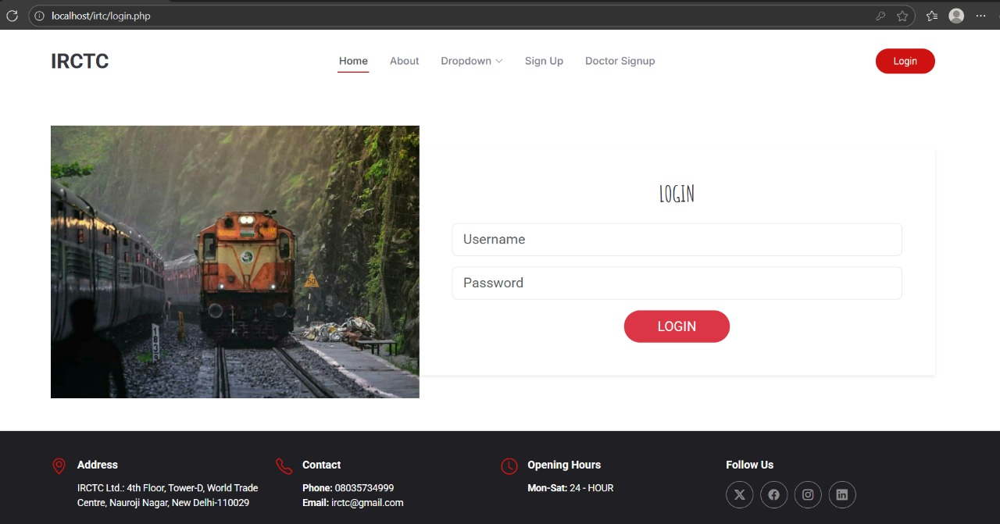
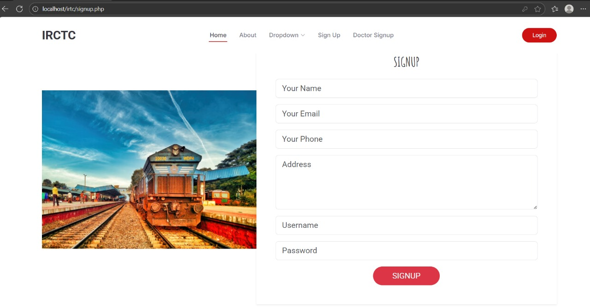
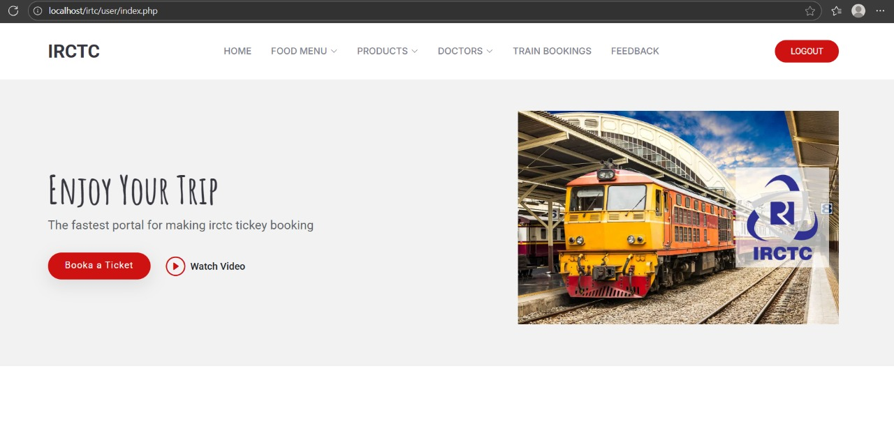
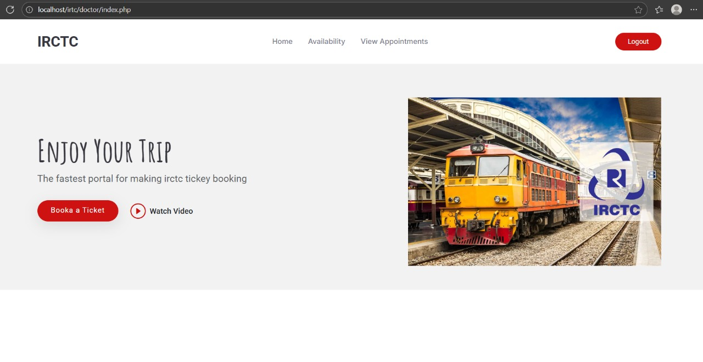
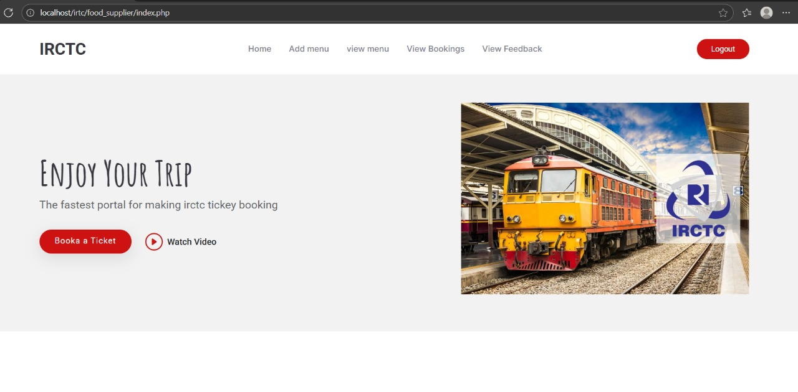
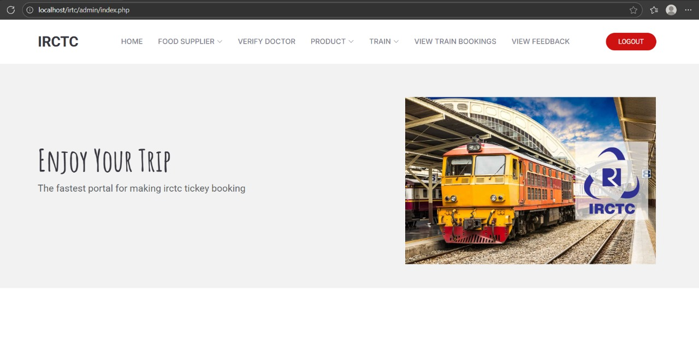

🌐 IRCTC Multi-Service Integrated Platform
A Unified Web Platform for Train Booking, Food Delivery, Doctor Appointments & Online Shopping
📖 Introduction

The IRCTC Multi-Service Integrated Platform is a comprehensive web-based system designed to unify essential services — train booking, food ordering, doctor consultations, and online shopping — into a single, seamless platform.

In the current digital landscape, users rely on multiple separate applications, leading to inefficiency and poor user experience. This project eliminates fragmentation by providing a fully integrated, role-based platform for:

Users (Passengers)

Administrators

Doctors

Food Suppliers

Vendors

The system ensures smooth navigation, faster service access, secure authentication, and real-time updates.

🚀 Key Features
👤 User Module

Register/Login

Train search & booking

Doctor appointment scheduling

Order food to be delivered on train or at stations

Online shopping

Booking history & profile management

Submit feedback

User dashboard

🛠️ Admin Module

Manage users, doctors, suppliers, vendors

Approve/reject registrations

Add/manage trains, schedules & routes

View bookings, cancellations, refunds

Review feedback & complaints

Track revenue and performance

Analytics dashboard

👨‍⚕️ Doctor Module

Manage availability

Approve/reject appointment requests

View appointment history

🍽️ Food Supplier Module

Manage menu & pricing

Accept/decline food orders

Update delivery status

🛍️ Vendor Module

Manage product listings

Track orders

Monitor inventory

View revenue statistics

⚙️ Technology Stack
Layer	Technology
Frontend	HTML, CSS, JavaScript
Backend	PHP
Server	Apache
Database	MySQL
IDE	Visual Studio Code
Environment	XAMPP / WAMP / LAMP
📁 Project Structure
IRCTC-Integrated-Platform/
│── admin/
│── user/
│── doctor/
│── food_supplier/
│── vendor/
│── assets/
│── uploads/
│── screenshorts/
│── connection.php
│── login.php
│── signup.php
└── README.md

📸 Screenshots

Below are the key UI screens of the application.

🏠 1. Home Page

🔐 2. Login Page

📝 3. Signup Page

👤 4. User Dashboard

🩺 5. Doctor Dashboard

🍽️ 6. Food Supplier Dashboard

🛠️ 7. Admin Dashboard

🧪 Testing
✔ Unit Testing

For individual modules (login, booking, ordering).

✔ Integration Testing

Ensures communication between modules (e.g., bookings & payments).

✔ System Testing

Validates complete workflows.

✔ User Acceptance Testing (UAT)

Ensures the platform meets user expectations.

🔐 Security Features

Secure login system

Role-based access control

Encrypted sensitive data

Input sanitization

SQL injection prevention

Secure session handling

📦 Installation Guide
1️⃣ Clone Repository
git clone https://github.com/your-username/irtc.git

2️⃣ Setup Database

Create a MySQL database (e.g., irctc)

Import the provided SQL file

Update DB details in connection.php

3️⃣ Start Apache & MySQL
4️⃣ Run the Project
http://localhost/irtc/

📈 Future Enhancements

Android/iOS mobile app

Cloud hosting for scalability

Email & SMS notifications

2-factor authentication

AI recommendations for doctors & food

Multi-language support

Taxi/hotel booking integration

Advanced analytics dashboard

📚 References

W3Schools

Themewagon

Wikipedia

IRCTC Online Resources
